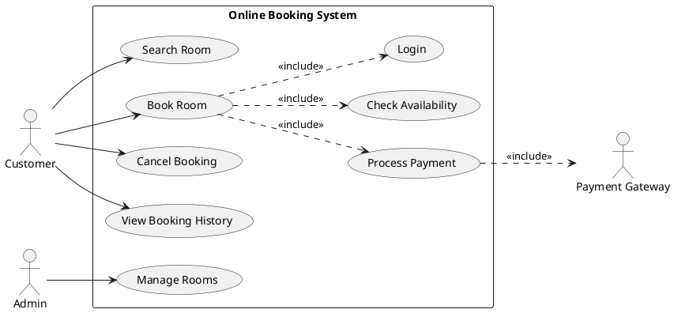

---

## name: usecase-microservices-3tier description: > Focused skill for writing Use Case Diagrams and designing systems using Microservices Architecture and 3-Tier Architecture. Use this skill whenever a user asks to write, design, or review a Use Case Diagram, define actors and use cases, plan system architecture with Microservices or 3-tier, map use cases to services/tiers, design API Gateway flows, or model any software system that combines use case analysis with Microservices or 3-tier patterns. Trigger for: "เขียน use case", "ออกแบบ Microservices", "3-tier architecture", "แบ่ง service", "API Gateway", "use case diagram". author: surachai version: 1.6 source: Design-2024-V1.6.pdf

# Use Case + Microservices + 3-Tier Architecture Skill

This skill focuses on **writing Use Cases** and **designing systems** with Microservices and 3-Tier architecture patterns.

---

## Table of Contents

1. [Use Case Diagram — Complete Guide](https://claude.ai/chat/941e7dab-ca4d-411e-97eb-f8967273f846#1-use-case-diagram--complete-guide)
2. [3-Tier Architecture](https://claude.ai/chat/941e7dab-ca4d-411e-97eb-f8967273f846#2-3-tier-architecture)
3. [Microservices Architecture](https://claude.ai/chat/941e7dab-ca4d-411e-97eb-f8967273f846#3-microservices-architecture)
4. [Mapping: Use Cases → Architecture](https://claude.ai/chat/941e7dab-ca4d-411e-97eb-f8967273f846#4-mapping-use-cases--architecture)
5. [Step-by-Step Design Workflow](https://claude.ai/chat/941e7dab-ca4d-411e-97eb-f8967273f846#5-step-by-step-design-workflow)
6. [Templates & Examples](https://claude.ai/chat/941e7dab-ca4d-411e-97eb-f8967273f846#6-templates--examples)

---

## 1. Use Case Diagram — Complete Guide

### What is a Use Case Diagram?

แสดงภาพรวมของระบบ (High-Level Design) — ความสัมพันธ์ระหว่าง Actor กับ ฟังก์ชันที่ระบบมี โดยไม่สนใจรายละเอียดการ implement ภายใน

---

### Basic Elements (องค์ประกอบพื้นฐาน)

|Element|Symbol|Description|
|---|---|---|
|**Actor**|🧍 (stick figure)|ผู้ใช้หรือระบบภายนอกที่มีปฏิสัมพันธ์กับระบบ|
|**Use Case**|○ (ellipse)|ฟังก์ชันที่ระบบมี|
|**System Boundary**|□ (rectangle)|ขอบเขตของระบบ|
|**Relationship**|lines/arrows|ความสัมพันธ์ระหว่างองค์ประกอบ|

---

### Naming Conventions (หลักการตั้งชื่อ)

**Use Case — ใช้ Verb + Noun:**

```
✅ Register Account
✅ Place Order
✅ Cancel Booking
✅ Generate Report
❌ Registration       (noun only)
❌ Order Processing   (too vague)
```

**Actor — ใช้ Noun บทบาท:**

```
✅ Customer
✅ Administrator
✅ Payment Gateway   (external system)
✅ Email Service     (external system)
❌ User123           (too specific)
❌ Person            (too generic)
```

**ชื่อต้อง:** สั้น กระชับ สื่อความหมายชัดเจน

---

### Relationship Types (ประเภทของ Relationships)

#### 1. Association (เส้นตรง)

ความสัมพันธ์พื้นฐานระหว่าง Actor กับ Use Case

```
Customer ———— Place Order
```

#### 2. Include `<<include>>`

Use Case หนึ่ง **ต้อง**เรียกใช้อีก Use Case หนึ่งเสมอ (mandatory sub-function)

```
Place Order ——<<include>>——→ Validate Payment
Place Order ——<<include>>——→ Check Stock
```

> ใช้เมื่อ: มี logic ที่ใช้ร่วมกันหลาย Use Case

#### 3. Extend `<<extend>>`

Use Case หนึ่ง **อาจ**ขยายพฤติกรรมของอีก Use Case หนึ่ง (optional/conditional behavior)

```
Place Order ←——<<extend>>—— Apply Discount Coupon
Login ←——<<extend>>—— Two-Factor Authentication
```

> ใช้เมื่อ: มีเงื่อนไขพิเศษที่เกิดขึ้นบางครั้ง

#### 4. Generalization (ลูกศรสามเหลี่ยมทึบ)

ความสัมพันธ์แบบ "is a" (inheritance)

```
Administrator ——▷ User
Premium Customer ——▷ Customer
```

---

### Design Principles (หลักการออกแบบ)

|Principle|Rule|
|---|---|
|**Single Responsibility**|แต่ละ Use Case ควรมีหน้าที่เดียวที่ชัดเจน|
|**Abstraction**|แสดงเฉพาะ "what" ไม่ใช่ "how"|
|**Modularity**|แบ่งฟังก์ชันเป็นส่วนๆ อย่างเหมาะสม|
|**Cohesion**|Use Case ที่เกี่ยวข้องกันควรอยู่กลุ่มเดียวกัน|

---

### Use Case Specification Template

เมื่อเขียน Use Case ที่ละเอียด ใช้ template นี้:

```
Use Case ID   : UC-001
Use Case Name : Place Order
Actor(s)      : Customer
Description   : ผู้ใช้ทำการสั่งซื้อสินค้า

Preconditions :
  - ผู้ใช้ต้อง Login แล้ว
  - มีสินค้าอยู่ใน Cart อย่างน้อย 1 ชิ้น

Main Flow (Basic Path):
  1. ผู้ใช้กดปุ่ม "Place Order"
  2. ระบบแสดงรายการสินค้าใน Cart
  3. ผู้ใช้เลือกที่อยู่จัดส่ง
  4. ผู้ใช้เลือกวิธีชำระเงิน
  5. ระบบตรวจสอบ Stock (<<include>> Check Stock)
  6. ระบบดำเนินการชำระเงิน (<<include>> Process Payment)
  7. ระบบสร้าง Order และส่ง Confirmation Email
  8. ระบบแสดงหน้า Order Summary

Alternative Flow:
  5a. Stock ไม่เพียงพอ → แจ้งผู้ใช้, เสนอสินค้าทดแทน
  6a. ชำระเงินไม่สำเร็จ → แจ้งผู้ใช้, กลับสู่ขั้นตอนชำระเงิน

Postconditions:
  - Order ถูกสร้างในระบบ
  - Stock ถูกหักลด
  - Email ยืนยันถูกส่ง
```

---

### Recommended Tools

- PlantUML — code-based diagrams
- StarUML — visual editor
- Visual Paradigm — enterprise-grade
- UMLet — lightweight, free
- draw.io / Figma — quick wireframe-level diagrams

---

## 2. 3-Tier Architecture

### Overview

```
┌─────────────────────────────────┐
│       PRESENTATION TIER         │  ← Client (Browser, Mobile App)
│   HTML/CSS/JS, React, Flutter   │
└────────────────┬────────────────┘
                 │ HTTP/HTTPS
┌────────────────▼────────────────┐
│        APPLICATION TIER         │  ← Server (Business Logic)
│   Java EE, PHP, Node.js, .NET   │
└────────────────┬────────────────┘
                 │ SQL / ORM
┌────────────────▼────────────────┐
│           DATA TIER             │  ← Database
│   MySQL, PostgreSQL, MongoDB    │
└─────────────────────────────────┘
```

### Each Tier's Responsibility

|Tier|Thai Name|Responsibility|Technology Examples|
|---|---|---|---|
|**Presentation Tier**|ส่วนนำเสนอ|การติดต่อระหว่างผู้ใช้กับ Application|React, Vue, Flutter, HTML/CSS|
|**Application Tier**|ส่วนตรรกะ|Business Logic, ประมวลผล, Validation|Node.js, Spring Boot, Laravel, Django|
|**Data Tier**|ส่วนข้อมูล|จัดการฐานข้อมูล, CRUD, Transactions|MySQL, PostgreSQL, MongoDB, Redis|

### 3-Tier vs MVC

||3-Tier|MVC|
|---|---|---|
|**Nature**|Physical/Deployment separation|Logical/Code separation|
|**Scope**|เน้นการแบ่ง server และ infrastructure|เน้นการแบ่ง code pattern ภายใน 1 tier|
|**Location**|Client ↔ App Server ↔ DB Server|ใน Application Tier เดียวกัน|

> **สรุป:** MVC อยู่ภายใน Application Tier ของ 3-Tier

### Use Case → 3-Tier Mapping

```
Use Case: "Place Order"

Presentation Tier  → Order Form UI, Cart Summary, Confirmation Page
Application Tier   → OrderController, OrderService, PaymentService
                      validateOrder(), calculateTotal(), processPayment()
Data Tier          → orders table, order_items table, inventory table
```

### When to Use 3-Tier

- ✅ Web applications ทั่วไป
- ✅ ระบบที่ต้องการแยก Frontend/Backend ชัดเจน
- ✅ ทีมขนาดเล็ก–กลาง
- ✅ ระบบที่ traffic ไม่สูงมาก
- ❌ ระบบที่ต้องการ scale แต่ละส่วนแยกกัน

---

## 3. Microservices Architecture

### Overview

แบ่งแยกระบบออกเป็นบริการเล็กๆ เป็นอิสระต่อกัน แต่ละ Service:

- Deploy ได้อิสระ
- มีฐานข้อมูลของตัวเอง
- สื่อสารผ่าน API (REST / gRPC / Message Queue)

```
                    ┌─────────────┐
Clients ──────────→ │ API Gateway │
                    └──────┬──────┘
           ┌───────────────┼───────────────┐
           ▼               ▼               ▼
    ┌─────────────┐ ┌─────────────┐ ┌─────────────┐
    │   User      │ │   Order     │ │  Payment    │
    │  Service    │ │  Service    │ │  Service    │
    └──────┬──────┘ └──────┬──────┘ └──────┬──────┘
           │               │               │
          DB              DB              DB
```

### Core Microservices Components

|Component|Role|
|---|---|
|**API Gateway**|จุดเข้าเดียวสำหรับ Client ทุกชนิด; routing, auth, rate limiting|
|**Service**|หน่วยการทำงานอิสระ มี business logic เฉพาะด้าน|
|**Service Database**|แต่ละ Service มี DB ของตัวเอง (Database per Service pattern)|
|**Message Broker**|Kafka/RabbitMQ สำหรับ async communication ระหว่าง Service|
|**Service Registry**|Consul/Eureka สำหรับ service discovery|

### Microservices vs SOA vs Monolithic

|Aspect|Monolithic|SOA|Microservices|
|---|---|---|---|
|**Size**|ทั้งระบบในก้อนเดียว|Services ขนาดกลาง|Services เล็กมาก|
|**Deployment**|Deploy พร้อมกันทั้งหมด|Deploy เป็น Service กลุ่ม|Deploy อิสระทีละ Service|
|**Database**|Database เดียวร่วมกัน|มักแชร์ Database|แยก Database ต่อ Service|
|**Communication**|In-process calls|ESB / SOAP|REST API / gRPC / Events|
|**Team**|ทีมเดียวดูแลทั้งหมด|ทีมดูแลตาม Domain|1 ทีมต่อ 1 Service|
|**Scale**|Scale ทั้งก้อน|Scale เป็น Service|Scale เฉพาะ Service ที่ต้องการ|
|**Complexity**|ง่าย|กลาง|สูง|

### When to Use Microservices

- ✅ ระบบขนาดใหญ่ที่มีหลาย Domain
- ✅ ทีมหลายทีมพัฒนาพร้อมกัน
- ✅ ต้องการ scale แต่ละ service แยกกัน
- ✅ ต้องการ technology stack ที่หลากหลาย
- ❌ ระบบขนาดเล็ก / ทีมเล็ก (overhead สูงเกินไป)
- ❌ เริ่มต้น project ใหม่ (start with Monolith first)

### Use Case → Microservices Mapping

```
Use Case: "Place Order"

Service Breakdown:
┌─────────────────────────────────────────────────────┐
│ API Gateway    → รับ request, auth token, routing   │
├─────────────────────────────────────────────────────┤
│ User Service   → ตรวจสอบ user session / profile     │
│   UC: Login, Register, View Profile                 │
├─────────────────────────────────────────────────────┤
│ Product Service → ตรวจสอบ stock, ดึงข้อมูลสินค้า   │
│   UC: Browse Products, Check Stock, Search Product  │
├─────────────────────────────────────────────────────┤
│ Order Service  → สร้าง order, จัดการ order          │
│   UC: Place Order, Cancel Order, View Order History │
├─────────────────────────────────────────────────────┤
│ Payment Service → ดำเนินการชำระเงิน                 │
│   UC: Process Payment, Refund, View Payment History │
├─────────────────────────────────────────────────────┤
│ Notification Service → ส่ง email/SMS               │
│   UC: Send Confirmation, Send Shipping Update       │
└─────────────────────────────────────────────────────┘
```

---

## 4. Mapping: Use Cases → Architecture

### Decision Matrix — Which Architecture?

|Scenario|Recommended|
|---|---|
|Use Cases < 20, ทีม < 5 คน|**3-Tier**|
|Use Cases 20–50, ทีม 5–20 คน|**3-Tier** หรือ **Modular Monolith**|
|Use Cases > 50, ทีม > 20 คน|**Microservices**|
|ต้องการ scale บาง feature มาก|**Microservices**|
|Budget จำกัด, เวลาน้อย|**3-Tier**|

---

### Use Case Grouping → Service Identification

**กฎการจัดกลุ่ม Use Case เป็น Service:**

```
1. Single Responsibility
   Use Cases ที่เกี่ยวกับ Entity เดียวกัน → Service เดียวกัน

2. High Cohesion
   Use Cases ที่มักถูกเรียกพร้อมกัน → Service เดียวกัน

3. Low Coupling
   Use Cases ที่ไม่ค่อยมีปฏิสัมพันธ์กัน → แยก Service

4. Business Domain (Domain-Driven Design)
   แบ่งตาม Bounded Context ของธุรกิจ
```

**Example — E-Commerce:**

```
User Domain     → User Service
  ├── Register Account
  ├── Login
  ├── Manage Profile
  └── Reset Password

Product Domain  → Product Service
  ├── Browse Products
  ├── Search Product
  ├── View Product Detail
  └── Manage Inventory (Admin)

Order Domain    → Order Service
  ├── Place Order
  ├── Cancel Order
  ├── Track Order
  └── View Order History

Payment Domain  → Payment Service
  ├── Process Payment
  ├── Request Refund
  └── View Transaction History
```

---

### 3-Tier Layer Assignment for Use Cases

สำหรับแต่ละ Use Case ระบุว่า logic อยู่ที่ tier ไหน:

```
Use Case: "Register Account"

Presentation Tier:
  - Registration Form (email, password, confirm password)
  - Validation feedback (real-time)
  - Success/Error messages

Application Tier:
  - validateEmail(email)
  - hashPassword(password)
  - checkDuplicateEmail(email)
  - createUser(userData)
  - sendVerificationEmail(email)

Data Tier:
  - INSERT INTO users (email, password_hash, created_at)
  - SELECT * FROM users WHERE email = ?
```

---

## 5. Step-by-Step Design Workflow

### Phase 1 — Identify Actors & Use Cases

```
Step 1: ระบุ Actors ทั้งหมด
  → ถามว่า: "ใครใช้ระบบนี้?"
  → ถามว่า: "ระบบภายนอกไหนเชื่อมต่อกับระบบ?"

Step 2: ระบุ Use Cases ต่อ Actor
  → ถามว่า: "Actor นี้ต้องการทำอะไรกับระบบ?"
  → แต่ละ Use Case = 1 goal ของ Actor

Step 3: ระบุ Relationships
  → หา <<include>>: มี logic ซ้ำที่หลาย UC ใช้หรือไม่?
  → หา <<extend>>: มี optional flow หรือไม่?
  → หา Generalization: มี Actor หรือ UC ที่สืบทอดกันหรือไม่?
```

### Phase 2 — Choose Architecture

```
Step 4: นับ Use Cases และ Domains
  → จัดกลุ่ม Use Cases ตาม Business Domain
  → ถ้า domain < 4 → พิจารณา 3-Tier
  → ถ้า domain >= 4 + ทีมใหญ่ → พิจารณา Microservices

Step 5: กำหนด Architecture Pattern
  → 3-Tier: วาง Presentation / Application / Data layer
  → Microservices: แบ่ง Domain → Service → API Gateway
```

### Phase 3 — Map Use Cases to Architecture

```
Step 6: Map Use Cases → Tiers (3-Tier) หรือ Services (Microservices)

  3-Tier:
    แต่ละ Use Case → อธิบาย logic ใน 3 layers
    Presentation: UI elements
    Application:  methods/functions
    Data:         tables/queries

  Microservices:
    แต่ละ Use Case → ระบุ Service เจ้าของ
    ระบุ Service ที่ต้องเรียก (dependencies)
    ออกแบบ API endpoint

Step 7: ออกแบบ API / Sequence Flow
  → ระบุ HTTP method + endpoint
  → ระบุ request/response format
  → ระบุ service-to-service calls
```

### Phase 4 — Validate Design

```
Step 8: ตรวจสอบ
  □ ทุก Actor มี Use Case อย่างน้อย 1 รายการ
  □ ทุก Use Case มี Actor อย่างน้อย 1 รายการ
  □ <<include>> ถูกเรียกใช้จริงเสมอ (ไม่ใช่ optional)
  □ <<extend>> เป็น optional จริงๆ
  □ แต่ละ Service/Tier มี Single Responsibility
  □ ไม่มี circular dependency ระหว่าง Service
```

---

## 6. Templates & Examples

### Template A — 3-Tier Use Case Design Document

```markdown
## System: [ชื่อระบบ]

### Actors
| Actor | Type | Description |
|---|---|---|
| Customer | Primary | ผู้ใช้งานทั่วไป |
| Admin | Primary | ผู้ดูแลระบบ |
| Payment Gateway | External System | ระบบชำระเงินภายนอก |

### Use Cases
| ID | Use Case | Actor | Priority |
|---|---|---|---|
| UC-001 | Register Account | Customer | High |
| UC-002 | Login | Customer, Admin | High |
| UC-003 | Place Order | Customer | High |

### 3-Tier Layer Design

#### UC-001: Register Account
| Tier | Component |
|---|---|
| **Presentation** | RegisterForm, PasswordStrengthMeter, SuccessModal |
| **Application** | AuthController.register(), UserService.createUser(), EmailService.sendVerification() |
| **Data** | users table: id, email, password_hash, verified, created_at |
```

---

### Template B — Microservices Use Case Design Document

```markdown
## System: [ชื่อระบบ]

### Service Map
| Service | Owns Use Cases | Database |
|---|---|---|
| user-service | Register, Login, Profile | users_db |
| order-service | Place Order, Cancel, Track | orders_db |
| payment-service | Process Payment, Refund | payments_db |
| notification-service | Send Email, Send SMS | - (stateless) |

### API Gateway Routes
| Method | Path | Service | Use Case |
|---|---|---|---|
| POST | /auth/register | user-service | Register Account |
| POST | /auth/login | user-service | Login |
| POST | /orders | order-service | Place Order |
| GET  | /orders/{id} | order-service | Track Order |
| POST | /payments | payment-service | Process Payment |

### Inter-Service Communication
| Trigger | Publisher | Event | Subscriber |
|---|---|---|---|
| Order placed | order-service | ORDER_CREATED | payment-service, notification-service |
| Payment done | payment-service | PAYMENT_SUCCESS | order-service, notification-service |
```

---

### Example — Online Booking System (ระบบจองห้องพัก)

#### Use Case Diagram (PlantUML)



#### 3-Tier Mapping

```
UC-002: Book Room

Presentation:
  - RoomSearchResult → RoomDetailPage → BookingForm
  - DatePicker, GuestCountSelector, PaymentForm
  - BookingConfirmationModal

Application Tier:
  - BookingController.createBooking(req)
  - RoomService.checkAvailability(roomId, dates)
  - BookingService.createReservation(userId, roomId, dates)
  - PaymentService.processPayment(bookingId, paymentInfo)
  - EmailService.sendConfirmation(userId, bookingDetails)

Data Tier:
  - rooms (id, name, type, price_per_night, capacity)
  - bookings (id, user_id, room_id, check_in, check_out, status)
  - payments (id, booking_id, amount, method, status, created_at)
```

#### Microservices Mapping

```
UC-002: Book Room

API Gateway → POST /bookings

1. room-service
   GET /rooms/{id}/availability?check_in=...&check_out=...
   Response: { available: true, price: 1500 }

2. user-service
   GET /users/{id}/profile (verify user)
   Response: { id, name, email, verified: true }

3. booking-service  ← ownner of UC
   POST /bookings
   Body: { userId, roomId, checkIn, checkOut }
   → publishes event: BOOKING_CREATED

4. payment-service  ← listens to BOOKING_CREATED
   POST /payments
   Body: { bookingId, amount, method }
   → publishes event: PAYMENT_SUCCESS / PAYMENT_FAILED

5. notification-service ← listens to PAYMENT_SUCCESS
   Sends confirmation email + SMS
```

---

### Quick Reference — Use Case + Architecture Cheat Sheet

|Item|3-Tier Rule|Microservices Rule|
|---|---|---|
|**Use Case ownership**|ทุก UC อยู่ใน Application Tier|แต่ละ UC สังกัด 1 Service|
|**Data access**|มีเพียง Data Tier เข้าถึง DB|แต่ละ Service เข้าถึง DB ตัวเอง|
|**Inter-UC calls**|method call ใน Application Tier|HTTP API หรือ Message Event|
|**Auth**|Middleware ใน Application Tier|API Gateway ระดับบน|
|**Scale**|Scale ทั้ง Application Tier|Scale เฉพาะ Service ที่ load สูง|
|**Deployment**|Deploy พร้อมกัน|Deploy แยกต่อ Service|
|**<<include>> becomes**|Shared Service class/method|Shared Service call หรือ common lib|
|**<<extend>> becomes**|Conditional if/else ใน method|Feature flag หรือ plugin Service|